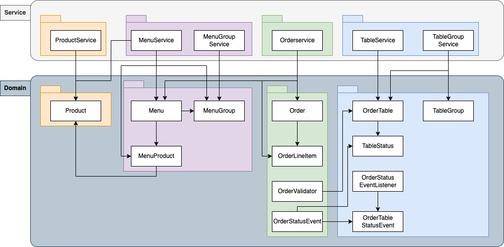

# 키친포스

## 요구 사항

### 상품을 관리할 수 있다.
- [ ] 상품을 등록할 수 있다.
    - [ ] 상품은 이름과 가격으로 관리된다.
    - [ ] 상품 이름과 가격은 필수이다.
    - [ ] 상품의 가격은 0원 이상이다.
- [ ] 상품의 목록을 조회할 수 있다.    

### 메뉴를 관리할 수 있다.
- [ ] 메뉴 그룹을 관리한다.
    - [ ] 메뉴 그룹을 등록할 수 있다.
    - [ ] 메뉴 그룹을 이름으로 관리한다.
    - [ ] 메뉴 그룹 목록을 조회할 수 있다.
- [ ] 메뉴는 항상 메뉴 그룹에 속한다.    
- [ ] 메뉴를 등록할 수 있다.  
    - [ ] 메뉴는 하나의 상품 혹은 여러개의 상품으로 구성된다.
    - [ ] 메뉴를 구성하는 상품의 수량을 관리한다.
    - [ ] 메뉴는 이름과 가격으로 관리한다.
        - [ ] 메뉴의 이름은 필수이다.
        - [ ] 메뉴의 가격은 0원 이상이다.
        - [ ] 메뉴의 가격은 구성하는 상품의 총 가격보다 작거나 같아야 한다.
- [ ] 메뉴 목록을 조회할 수 있다.

### (주문이 발생 할수 있는) 테이블을 관리할 수 있다.
- [ ] 주문 테이블과 빈 테이블로 관리한다.
    - [ ] 테이블을 등록할 수 있다.
    - [ ] 테이블의 목록을 조회할 수 있다.
- [ ] 테이블의 상태를 변경할 수 있다.
    - [ ] 주문이 진행중인(조리,식사) 테이블은 상태를 변경할 수 없다.
    - [ ] 단체 지정된 테이블은 상태를 변경할 수 없다.
- [ ] 테이블의 손님 수를 변경할 수 있다.
    - [ ] 손님의 수는 0 이상 이다.
    - [ ] 빈 테이블은 손님의 수를 변경할 수 없다.
- [ ] 단체를 지정할 수 있다.
    - [ ] 단체 지정을 등록할 수 있다.
        - [ ] 단체로 지정된 테이블은 주문 테이블이 된다.
        - [ ] 두 테이블 이상 단체 지정을 할 수 있다.
        - [ ] 빈 테이블만 단체로 지정할 수 있다.
        - [ ] 등록되어 있는 테이블만 단체지정이 가능하다.
    - [ ] 단체 지정을 삭제할 수 있다.
        - [ ] 단체로 지정된 테이블의 단체 지정을 해제한다.
        - [ ] 주문이 진행중인 테이블이 있으면 단체 지정을 해제할 수 없다.    

### 테이블별로 주문을 관리할 수 있다
- [ ] 주문을 등록할 수 있다.
    - [ ] 주문은 테이블별로 생성된다.
      - [ ] 빈 테이블은 주문을 생성할 수 없다.
    - [ ] 메뉴를 여러개 선택할 수 있다. 
      - [ ] 메뉴로 등록된 메뉴만 선택할 수 있다.
    - [ ] 주문이 되면 조리 상태가 된다.
- [ ] 주문 목록을 조회할 수 있다.
  - [ ] 전체 테이블의 주문 목록을 조회한다.
- [ ] 주문의 상태를 관리한다 -> 조리 > 식사 > 계산완료
    - [ ] 이미 계산완료된 주문은 상태를 변경할 수 없다.
    

---
## 용어 사전

| 한글명 | 영문명 | 설명 |
| --- | --- | --- |
| 상품 | product | 메뉴를 관리하는 기준이 되는 데이터 |
| 메뉴 그룹 | menu group | 메뉴 묶음, 분류 |
| 메뉴 | menu | 메뉴 그룹에 속하는 실제 주문 가능 단위 |
| 메뉴 상품 | menu product | 메뉴에 속하는 수량이 있는 상품 |
| 금액 | amount | 가격 * 수량 |
| 주문 테이블 | order table | 매장에서 주문이 발생하는 영역 |
| 빈 테이블 | empty table | 주문을 등록할 수 없는 주문 테이블 |
| 주문 | order | 매장에서 발생하는 주문 |
| 주문 상태 | order status | 주문은 조리 ➜ 식사 ➜ 계산 완료 순서로 진행된다. |
| 방문한 손님 수 | number of guests | 필수 사항은 아니며 주문은 0명으로 등록할 수 있다. |
| 단체 지정 | table group | 통합 계산을 위해 개별 주문 테이블을 그룹화하는 기능 |
| 주문 항목 | order line item | 주문에 속하는 수량이 있는 메뉴 |
| 매장 식사 | eat in | 포장하지 않고 매장에서 식사하는 것 |

 

---

 

## 기능 구현 목록
### 미션 1 - 테스트를 통한 코드 보호
- [x] 요구사항 1 - 키친포스의 요구 사항을 README.md에 작성한다.
- [x] 요구사항 2 - 요구사항을 토대로 테스트 코드를 작성한다.
    - [x] 모든 Business Object 에 대한 테스트 코드를 작성한다.
    - [x] `@SpringBootTest` 를 이용한 통합테스트 코드 또는 `@ExtendWith(MockitoExtension.class)` 를 활용한 단위 테스트 코드를 작성한다.
    - [x] 인수테스트는 권장하지만 필수는 아니다.
    - [x] Lombok은 사용하지 않는다!!
### 미션 2 - 서비스 리팩터링
- [x] 단위 테스트 하기 어려운 코드와 단위 테스트 가능한 코드를 분리해 단위 테스트 가능한 코드에 대해 단위 테스트를 구현한다.
    - [x] 테스트 하기 쉬운 부분과 어려운 부분을 분리한다. -> 서비스에 있는 비지니스 로직을 도메인으로 옮긴다.
    - [x] JPA 를 적용해 보자.
    - [x] Bounded context에 따라 패키지 나누기

### 3단계 - 의존성 리팩터링
- [x] 메뉴정보가 변경되더라고 주문 항목이 변경되지 않도록 구현한다.
- [x] 패키지, 클래스간 방향성 설정 - 되도록이면 단방향

## 4단계 - 멀티 모듈 적용
* Gradle의 멀티 모듈 개념을 적용해 자유롭게 서로 다른 프로젝트로 분리해 본다.
    - [ ] 컨텍스트 간의 독립된 모듈로 만들 수 있다.
  > 긴밀하게 연관된 도메인을 묶는다. menu-product, order-table, 공통 모듈(VO, BaseEntity, Exception)
    - [ ] 계층간 독립된 모듈로 만들 수 있다.
  > ui, application, domain 계층으로 나눈다.
* 의존성 주입, HTTP 요청/응답, 이벤트 발행/구독 등 다양한 방식으로 모듈 간 데이터를 주고받을 수 있다.

